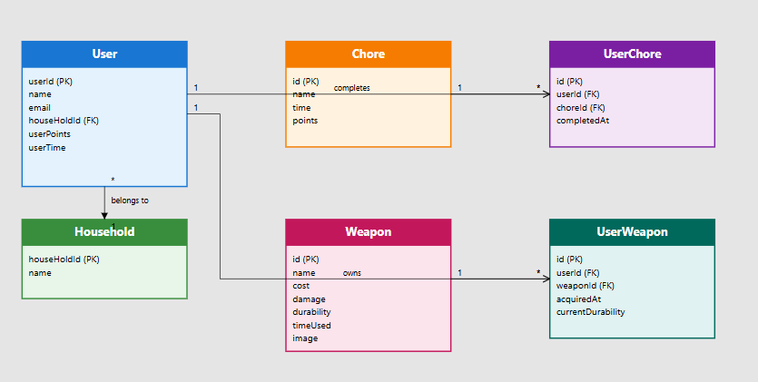

# Chore Champions

A gamified household chore management system where users earn points by completing chores and can spend those points on fun "weapons" as rewards.

## Overview

Chore Champions transforms mundane household tasks into an engaging game-like experience. Users complete chores to earn points and time credits, which they can then spend on collecting various household "weapons" (fun items like wrapping paper tubes).

## Data Models

### User
Represents a member of a household who can complete chores and collect weapons.

```javascript
{
  userId: 1,                    // Primary key
  name: "Shan",                 // User's display name
  email: "shan@email.com",      // Unique email for authentication
  password: "abc",              // Hashed password for authentication
  houseHoldId: 1,              // Foreign key to Household table
  userPoints: 5,               // Current points balance
  userTime: 5                  // Time credits earned
}
```

### Chore
Defines a household task that users can complete to earn rewards.

```javascript
{
  id: 1,                       // Primary key
  name: 'Wash Dishes',         // Chore description
  time: 15,                    // Time required to complete (minutes)
  points: 10                   // Points earned upon completion
}
```

### Weapon
Represents collectible items that users can purchase with their earned points.

```javascript
{
  id: 1,                       // Primary key
  name: 'Wrapping Paper Tube', // Weapon name
  cost: 5,                     // Points required to purchase
  damage: 2,                   // Attack power (for gamification)
  durability: 1,               // Number of uses before breaking
  timeUsed: 0,                 // Tracks usage count
  image: 'public/tube.png'     // Path to weapon image
}
```

### Household
Groups users together, typically representing a family or roommates sharing chores.

```javascript
{
  houseHoldId: 1,              // Primary key
  name: 'The Smith Family',    // Household name
  createdAt: '2024-01-01',     // Date household was created
  inviteCode: 'SMITH123'       // Unique code for joining household
}
```

## Database Architecture

### Entity Relationship Diagram


### Relational Tables

The system uses junction tables to manage many-to-many relationships:

1. **UserChore** - Tracks which chores users have assigned/completed
   - `id` (Primary Key)
   - `userId` (Foreign Key → User)
   - `choreId` (Foreign Key → Chore)
   - `status` (e.g., 'assigned', 'completed')
   - `completedAt` (Timestamp)

2. **UserWeapon** - Manages user's weapon inventory
   - `id` (Primary Key)
   - `userId` (Foreign Key → User)
   - `weaponId` (Foreign Key → Weapon)
   - `currentDurability` (Tracks remaining uses)
   - `acquiredAt` (Timestamp)

## Backend API Requirements

### Chore Management

#### 1. Get All Chores
- **Endpoint**: `GET /chores`
- **Purpose**: Populate the available chores list in the UI
- **Response**: Array of all chore objects

#### 2. Assign Chore to User
- **Endpoint**: `POST /user-chores`
- **Purpose**: Add a chore to a user's task list
- **Request Body**: `{ userId, choreId }`
- **Response**: Created UserChore object

#### 3. Complete Chore
- **Endpoint**: `DELETE /user-chores/:id`
- **Purpose**: Mark chore as completed and award points
- **Side Effects**: 
  - Remove chore from user's active list
  - Update user's points and time balance

  #### 4. get Chore history
- **Endpoint**: `GET /user-chores/History`
- **Purpose**: Show all completed chores ordered by time stamp
- **Side Effects**: 
 

### Weapon Management

#### 4. Get All Weapons
- **Endpoint**: `GET /weapons`
- **Purpose**: Display available weapons in the shop
- **Response**: Array of all weapon objects

#### 5. Purchase Weapon
- **Endpoint**: `POST /user-weapons`
- **Purpose**: Add weapon to user's inventory
- **Request Body**: `{ userId, weaponId }`
- **Validation**: Check if user has enough points
- **Side Effects**: Deduct points from user balance

#### 6. Use/Break Weapon
- **Endpoint**: `DELETE /user-weapons/:id`
- **Purpose**: Remove weapon when durability reaches zero
- **Trigger**: When `currentDurability` = 0

### User Management

#### 7. Update User Stats
- **Endpoint**: `PUT /users/:id`
- **Purpose**: Update user points and time
- **Request Body**: Complete user object with updated values
- **Note**: Frontend sends the entire user object with new point/time values

## Technical Stack Recommendations

### Backend (Java/Spring Boot)
- **Framework**: Spring Boot 3.x
- **Database**: PostgreSQL
- **ORM**: Spring Data JPA/Hibernate
- **API**: RESTful endpoints
- **Authentication**: Spring Security with JWT

### Frontend (React)
- **Framework**: React 18.x
- **State Management**: Context API or Redux
- **Routing**: React Router
- **UI Components**: Material-UI or custom components
- **HTTP Client**: Axios

### Database Schema Example (PostgreSQL)

```sql
-- Households table
CREATE TABLE households (
    household_id SERIAL PRIMARY KEY,
    name VARCHAR(200) NOT NULL,
    created_at TIMESTAMP DEFAULT CURRENT_TIMESTAMP,
    invite_code VARCHAR(50) UNIQUE
);

-- Users table
CREATE TABLE users (
    user_id SERIAL PRIMARY KEY,
    name VARCHAR(100) NOT NULL,
    email VARCHAR(255) UNIQUE NOT NULL,
    password VARCHAR(255) NOT NULL,
    household_id INTEGER REFERENCES households(household_id),
    user_points INTEGER DEFAULT 0,
    user_time INTEGER DEFAULT 0
);

-- Chores table
CREATE TABLE chores (
    id SERIAL PRIMARY KEY,
    name VARCHAR(200) NOT NULL,
    time INTEGER NOT NULL,
    points INTEGER NOT NULL
);

-- Weapons table
CREATE TABLE weapons (
    id SERIAL PRIMARY KEY,
    name VARCHAR(200) NOT NULL,
    cost INTEGER NOT NULL,
    damage INTEGER NOT NULL,
    durability INTEGER NOT NULL,
    time_used INTEGER DEFAULT 0,
    image VARCHAR(500)
);

-- Junction tables
CREATE TABLE user_chores (
    id SERIAL PRIMARY KEY,
    user_id INTEGER REFERENCES users(user_id),
    chore_id INTEGER REFERENCES chores(id),
    status VARCHAR(50) DEFAULT 'assigned',
    completed_at TIMESTAMP
);

CREATE TABLE user_weapons (
    id SERIAL PRIMARY KEY,
    user_id INTEGER REFERENCES users(user_id),
    weapon_id INTEGER REFERENCES weapons(id),
    current_durability INTEGER,
    acquired_at TIMESTAMP DEFAULT CURRENT_TIMESTAMP
);
```

## Future Enhancements

1. **Household Management**: Allow users to create/join households
2. **Chore Scheduling**: Recurring chores with due dates
3. **Leaderboards**: Compare points within households
4. **Weapon Trading**: Allow users to trade weapons
5. **Achievement System**: Badges for completing chore streaks
6. **Mobile App**: React Native implementation